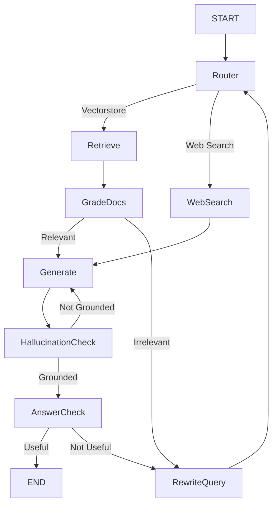

# 🔗 Adaptive RAG System with LangGraph, Groq & Web Search

An end-to-end production-ready Adaptive Retrieval-Augmented Generation (RAG) system that dynamically routes user queries between local vectorstore retrieval and live web search, applies multi-stage relevance filtering, query rewriting, and hallucination detection, and guarantees fact-grounded, question-aligned answers.

This project demonstrates agentic decision-making using LangGraph, making it suitable for enterprise RAG systems, SCADA / technical documentation QA, and reliable AI assistants.

## 🧠 Key Features

### 🔀 Intelligent Query Routing
Routes queries to:
- **Vectorstore** (FAISS + embeddings) for document-grounded questions
- **Web Search** (Tavily) for open-world or fresh information

### 📚 PDF-based Knowledge Ingestion
Chunked, embedded, and indexed technical documents (SCADA specs, manuals, etc.)

### 🧪 Document Relevance Grading
Filters irrelevant chunks using structured LLM evaluation

### ✍️ Query Rewriting Agent
Improves retrieval quality when documents are insufficient

### 🧠 Hallucination Detection
Ensures answers are strictly grounded in retrieved facts

### ✅ Answer–Question Alignment Check
Verifies the final answer actually resolves the user's question

### 🕸️ Agentic Workflow with LangGraph
Deterministic, debuggable, production-grade control flow

## 🏗️ Architecture Overview



### 📂 Project Structure
```
├── data/
│   └── FAT_SCADA_AL_KUS.pdf
│
├── retriever/
│   ├── pdf_loader.py
│   ├── embeddings.py
│   └── vectorstore.py
│
├── agents/
│   ├── router.py
│   ├── grader.py
│   ├── hallucination_checker.py
│   ├── answer_checker.py
│   └── query_rewriter.py
│
├── graph/
│   └── rag_graph.py
│
├── .env.example
├── requirements.txt
└── README.md
```

### ⚙️ Environment Setup
1️⃣ Clone the Repository
```bash
git clone https://github.com/your-username/adaptive-rag-langgraph.git
cd adaptive-rag-langgraph
```
2️⃣ Create Virtual Environment
```bash
python -m venv venv
source venv/bin/activate  # Windows: venv\Scripts\activate
```
3️⃣ Install Dependencies
```bash
pip install -r requirements.txt
```
### 🔑 Environment Variables
```
Create a .env file in the root directory:

env
groq_api_key=YOUR_GROQ_API_KEY
TAVILY_API_KEY=YOUR_TAVILY_API_KEY
hf_api_key=YOUR_HUGGINGFACE_API_KEY
```
⚠️ Never commit .env files to GitHub.

### 📥 Document Ingestion Pipeline
1. Loader: PyPDFLoader

2. Chunking: RecursiveCharacterTextSplitter

3. Embeddings: nomic-embed-text via Ollama

4. Vector Store: FAISS
```
python
RecursiveCharacterTextSplitter(
    chunk_size=2200,
    chunk_overlap=240
)
```
Optimized for technical PDFs and engineering documentation.

### 🤖 LLM Stack
Purpose	Model
```
Query Routing	llama-3.1-8b-instant
Document Grading	llama-3.1-8b-instant
Query Rewriting	llama-3.1-8b-instant
Hallucination Check	llama-3.1-8b-instant
Final Answer Generation	openai/gpt-oss-120b
```
All grading steps use structured outputs via Pydantic to enforce strict binary decisions (yes / no).

### 🧠 Agentic Decision Logic
Routing Decision
vectorstore ← technical / document-based queries

web_search ← exploratory or real-time queries

This creates a self-correcting RAG loop.

### ▶️ Running the System
```python
graph.invoke({
    "question": "SCADA Functional Design Specifications"
})
```
The system automatically:

Routes the question

Retrieves or searches

Filters documents

Generates answer

Validates grounding and relevance

### 📊 Why This Is Production-Ready
✔ Deterministic graph execution
✔ Explicit failure handling
✔ Structured LLM outputs (no parsing hacks)
✔ Multi-agent quality control
✔ Easily extensible nodes
✔ Debuggable & observable flow


### 🛠️ Tech Stack
LangChain

LangGraph

Groq

FAISS

Ollama

Tavily Search

Pydantic

Python 3.10+

### 📌 Future Improvements
Async graph execution

Caching & persistence layer

Observability (LangSmith / OpenTelemetry)

Multi-PDF routing

Tool-calling expansion
